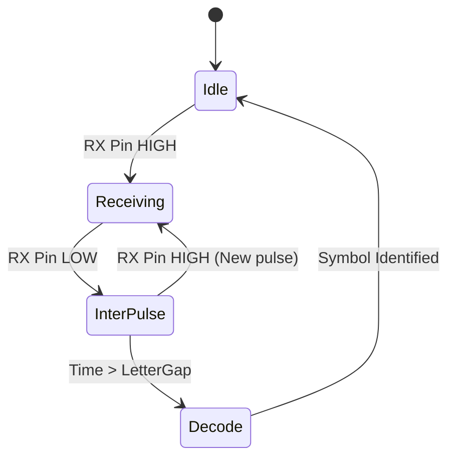

## Система (полу)дуплексной связи на основе азбуки Морзе

Проект реализует систему связи между двумя Arduino с использованием азбуки Морзе. Система поддерживает передачу текстовых сообщений через Serial-порт (автоматический режим) и ручную отправку сигналов через тактовую кнопку (Raw-режим), с выводом принятых данных на LCD-дисплей.

## Ссылки 

* [**Симуляция Tinkercad**](https://www.tinkercad.com/things/biTb7GczJ4b-morsecode)
* [**Видео-демонстрация**](https://disk.yandex.ru/d/Akw_K23gmVyccg)


### 1. Описание системы

Система состоит из двух узлов (Board ID 1 и Board ID 2). Каждый узел способен:
1.  **Принимать сигнал:** Декодировать последовательность импульсов (точек и тире) в ASCII-символы.
2.  **Передавать сигнал:**
    *   *Автоматически:* Преобразовывать ввод из Serial Monitor в импульсы Морзе.
    *   *Вручную:* Прямая трансляция нажатия кнопки в линию передачи (Raw-режим).

Вывод информации осуществляется на LCD дисплей (I2C) и в Serial Monitor для отладки.

### Аппаратная конфигурация (на один МК)

| Компонент  | Пин Arduino      | Описание                          |
|:-----------|:-----------------|:----------------------------------|
| **RX Pin** | 7                | Вход данных (Input)               |
| **TX Pin** | 8                | Выход данных (Output)             |
| **Button** | 4                | Кнопка для ручного ввода (Raw)    |
| **LED**    | 9                | Индикация статуса приема/передачи |
| **LCD**    | I2C <br/>A4 и A5 | Вывод декодированных сообщений    |

**Схема соединения МК:**
*   `TX` первого МК подключается к `RX` второго МК.
*   `RX` первого МК подключается к `TX` второго МК.
*   Земли (GND) объединены.


### 2. Логика работы и протокол

### 2.1 Временные параметры (Timings)
Система использует базовую единицу времени `dotLen = 300 ms`.
*   **Точка (.):** `< 450 ms` (1.5 * dotLen)
*   **Тире (-):** `> 450 ms`
*   **Пауза между буквами:** `900 ms` (3 * dotLen)
*   **Пауза между словами:** `2100 ms` (7 * dotLen)

### 2.2 Режимы передачи (Normal vs Raw)

В системе реализованы два подхода к формированию сигнала, которые прозрачны для приемника:

1.  **Normal Mode (Автоматический):**
    *   Пользователь вводит символ в Serial Monitor.
    *   МК ищет код символа в таблице (массиве).
    *   Функция `sendPulse()` генерирует "идеальные" тайминги, управляя пином `TX_PIN`.
    *   Во время пауз используется функция `smartWait()`, которая позволяет не блокировать прием входящих сообщений.

2.  **Raw Mode (Ручной):**
    *   Пользователь нажимает физическую кнопку.
    *   Состояние кнопки **напрямую** копируется на `TX_PIN` (`digitalWrite(TX_PIN, HIGH/LOW)`).
    *   Никакой программной коррекции длительности не происходит — длительность точки или тире зависит исключительно от человека.
    *   МК параллельно замеряет длительность собственных нажатий для логирования отправленных символов в Serial.

### 2.3 Алгоритм приема (Конечный автомат)

Приемник работает в основном цикле `loop()` без блокирующих задержек.

**Диаграмма состояний приемника:**



1.  **Idle (Ожидание):** Мониторинг пина `RX`.
2.  **Receiving (Прием импульса):** Замер времени старта импульса (`millis()`).
3.  **Signal Logic:** При переходе в LOW вычисляется длительность.
    *   Если `duration < dashThreshold` → записываем `.`
    *   Если `duration > dashThreshold` → записываем `-`
4.  **Decoding (Декодирование):** Если пин `RX` находится в LOW дольше, чем `letterGap`, накопленный буфер (например, `...---...`) преобразуется в символ ASCII.


### 3. Программная реализация

### Неблокирующая архитектура
Одной из ключевых особенностей кода является использование функции `smartWait()` вместо стандартного `delay()`. Это позволяет МК "слушать" эфир даже в моменты пауз между посылками своих сообщений.

```cpp
void smartWait(unsigned long ms) {
  unsigned long t = millis();
  while (millis() - t < ms) {
    checkRx(); // Продолжаем проверять входной пин
  }
}
```

### Структура пакета
Хотя передача идет потоком импульсов, логически передача разбивается на символы благодаря паузам (Silence).
*   **START/END:** В данной реализации роль маркеров выполняют временные паузы (`letterGap`).
*   **PAYLOAD:** Последовательность точек и тире, соответствующая таблице кодировки.


### 4. Запуск и установка

1.  Открыть проект в Arduino IDE или VS Code.
2.  Установить библиотеки `LiquidCrystal_I2C`.
3.  Для первого МК установить в коде `#define BOARD_ID 1`.
4.  Для второго МК установить в коде `#define BOARD_ID 2`.
5.  Загрузить прошивку.
6.  Для проверки авто-режима: Открыть Serial Monitor (9600 baud), ввести текст (A-Z, 0-9).
7.  Для проверки Raw-режима: Использовать кнопку на макете.
